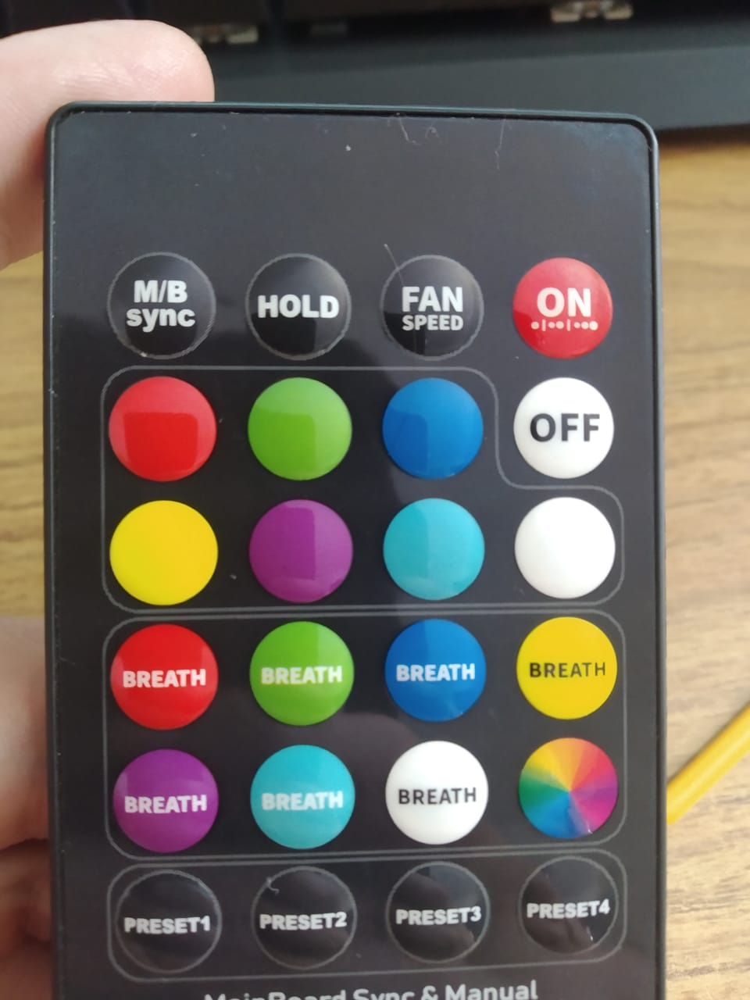
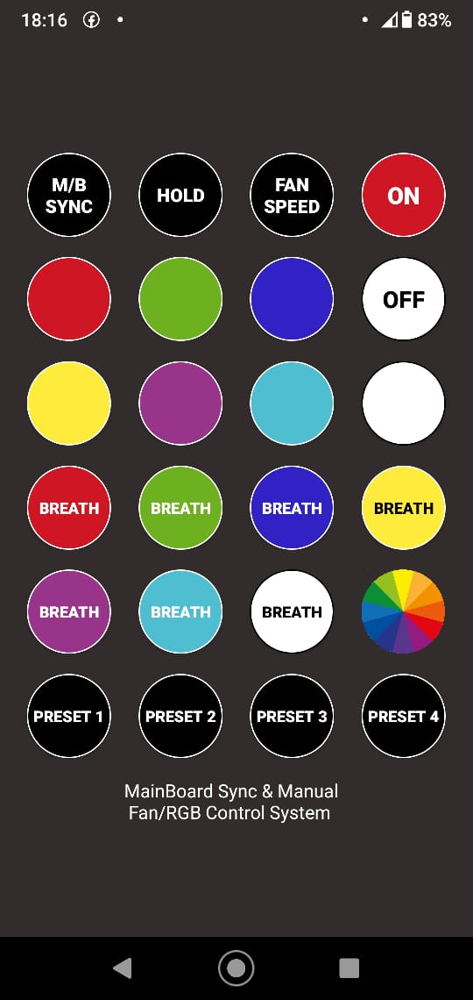

# IR FAN CONTROLLER

## About
Just another IR controller Android app

## Motivation

Few years ago, i bought a set of RGB fans from Aigo, controlled by IR remote. Since my motherboard doesn't have Aura sync or similar, this is the only way to change colors from my fans.

I lost the IR controller and found it again, and now it's starting to break. To avoid being unable to control my fans, I decide to it on my startphone.

## Process
How I create this app:

1. With an Arduino and IR sensor, I found the IR codes from each button of the controll
2. I take a picture of controller, and using Gimp I found the rgb color of the buttons
3. Then, I create a new Android Studio Project, designed the screen and using the codes found on 1st step, I send the IR signals using ConsummerIrService from AndroidSDK

## Final result

Now I can control my RGB fans using my mobile.

## Credits

Icons made by <a href="https://www.flaticon.com/authors/smalllikeart" title="smalllikeart">smalllikeart</a> from <a href="https://www.flaticon.com/" title="Flaticon">www.flaticon.com</a>

